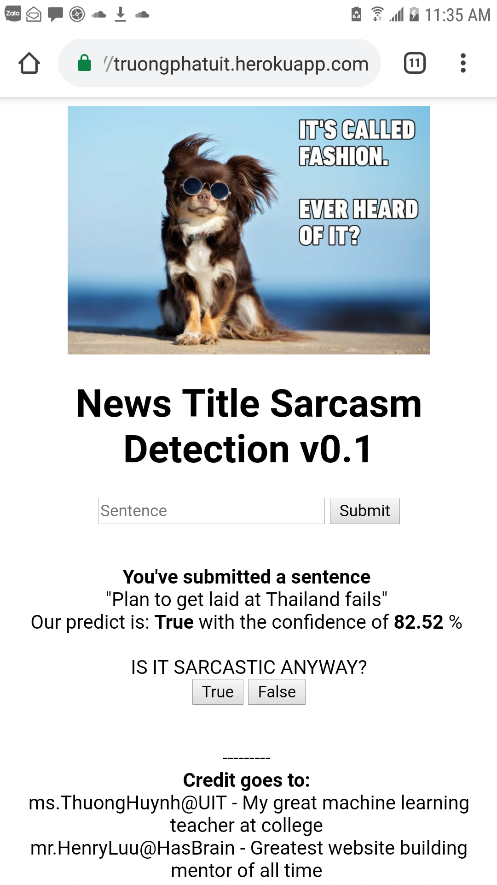

# Flask-App
A simple Flask App using Python

# Description
A simple flask app to predict if a title of news is sarcasm or not

 

# Modeling:
- Text2Vec with TFIDF Embedding in sklearn.feature_extraction.text.TfidfVectorizer
- Pretrained model on scikit-learn
